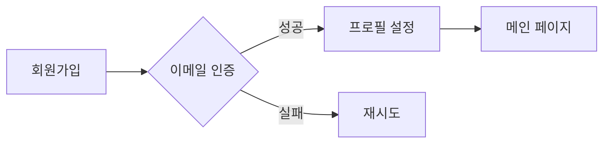

# 🚀 Next.js와 Supabase를 활용한 인스타그램 클론

실시간 채팅과 인증 기능이 구현된 인스타그램 스타일의 소셜 네트워크 서비스입니다.

## ⚡ 핵심 기술 스택

### 📱 프론트엔드
- **Next.js 14** 
  - App Router를 활용한 서버 컴포넌트 구현
  - 서버 사이드 렌더링으로 초기 로딩 성능 최적화
  - 클라이언트/서버 컴포넌트 분리로 효율적인 하이드레이션

- **TypeScript**
  - 타입 안정성 강화
  - 개발 시 버그 사전 방지
  - 코드 자동완성으로 생산성 향상

- **TailwindCSS & Material Tailwind**
  - Utility-First CSS로 빠른 스타일링
  - Material Design 기반 컴포넌트로 일관된 UI
  - 반응형 디자인 구현

- **상태 관리**
  - Recoil: 채팅 UI, 사용자 선택 등 클라이언트 상태 관리
  - React Query: 서버 데이터 캐싱 및 실시간 동기화

### 🛠 백엔드 - Supabase

#### 📊 데이터베이스 스키마

**메시지 테이블 (message)**
```sql
- id: bigint (PK, auto-increment)
- message: text (메시지 내용)
- sender: uuid (발신자 ID)
- receiver: uuid (수신자 ID)
- is_deleted: boolean (삭제 여부)
- created_at: timestamptz (생성 시간)
```

#### 🔐 인증 시스템
1. **이메일/비밀번호 인증**
   - OTP 기반 이메일 인증
   - 비밀번호 암호화 저장
   - 세션 기반 인증 상태 관리

2. **소셜 로그인**
   - 카카오 OAuth 2.0 연동
   - JWT 토큰 기반 인증
   - 자동 프로필 동기화(e-mail)

#### 🔄 실시간 기능

1. **채팅 시스템**
   - Supabase Realtime으로 즉각적인 메시지 전송
   - 읽음 상태 실시간 업데이트
   - 1:1 채팅방 자동 생성

2. **사용자 상태 관리**
   - Presence 기능으로 온라인 상태 추적
   - 마지막 접속 시간 자동 업데이트
   - 실시간 상태 변경 알림

## 💡 주요 기능 상세

### 1. 인증 플로우


### 2. 채팅 기능
- ✉️ 실시간 메시지 전송/수신
- 👥 사용자 목록에서 온라인 상태 표시

### 3. 데이터 흐름 관리
- 📡 서버 상태와 클라이언트 상태 분리
- 🔄 실시간 업데이트를 위한 Subscription 관리


# 폴더구조

📦 root
├── 📂 actions
│   └── 📄 chatActions.ts        # 채팅 관련 서버 액션 (메시지 전송, 조회)
│
├── 📂 app                       # Next.js 14 App Router
│   ├── 📂 auth
│   │   └── 📄 callback         # OAuth 콜백 처리
│   ├── 📂 chat                 # 채팅 페이지
│   ├── 📂 discover            # 검색/탐색 페이지
│   ├── 📂 people              # 사용자 목록 페이지
│   └── 📄 layout.tsx          # 루트 레이아웃
│
├── 📂 components
│   ├── 📂 auth                # 인증 관련 컴포넌트
│   │   ├── 📄 index.tsx       # 인증 메인 컴포넌트
│   │   ├── 📄 signin.tsx      # 로그인 컴포넌트
│   │   └── 📄 signup.tsx      # 회원가입 컴포넌트
│   │
│   ├── 📂 chat               # 채팅 관련 컴포넌트
│   │   ├── 📄 ChatPeopleList.tsx  # 채팅 사용자 목록
│   │   ├── 📄 ChatScreen.tsx      # 채팅 화면
│   │   ├── 📄 Message.tsx         # 메시지 버블
│   │   └── 📄 Person.tsx          # 사용자 아이템
│   │
│   ├── 📂 layouts            # 레이아웃 컴포넌트
│   │   └── 📄 main-layout.tsx    # 메인 레이아웃
│   │
│   └── 📄 sidebar.tsx        # 사이드바 네비게이션
│
├── 📂 config                 # 설정 파일
│   ├── 📄 auth-provider.tsx           # 인증 상태 관리
│   ├── 📄 ReactQueryClientProvider.tsx # React Query 설정
│   └── 📄 RecoilProvider.tsx          # Recoil 설정
│
├── 📂 utils                 # 유틸리티 함수들
│   ├── 📂 supabase         # Supabase 관련
│   │   ├── 📄 server.ts    # 서버 사이드 클라이언트
│   │   └── 📄 client.ts    # 클라이언트 사이드 클라이언트
│   │
│   ├── 📂 recoil           # Recoil 관련
│   │   └── 📄 atoms.ts     # Recoil 상태 정의
│   │
│   └── 📄 random.ts        # 유틸리티 함수
│
└── 📄 types_db.ts          # Supabase 데이터베이스 타입 정의